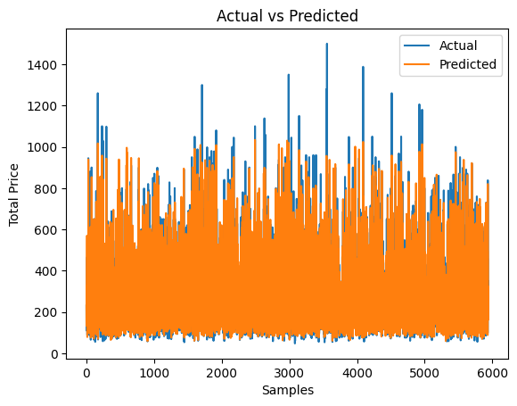

# GitHub 文档介绍

## 爬取链家网二手房信息

这个项目涉及使用Python从链家网站上爬取各个城市的二手房信息。脚本利用代理、线程和网络爬虫技术来收集数据。

### 特点
- 利用代理访问网络内容
- 爬取单个城市的数据
- 提取房屋信息如标题、地址、房间详情、价格等
- 将数据写入每个城市的CSV文件中

### 数据预处理和分析

项目的第二部分涉及数据预处理、异常值检测、特征选择和使用机器学习技术构建预测模型。

#### 数据预处理
- 将房间详情拆分为卧室和客厅
- 计算住宅区和小区的平均价格和排名
- 对“总价”列应用Box-Cox转换

#### 异常值检测
- 使用孤立森林模型检测异常值
- 从数据集中过滤出异常值

#### 特征选择
- 利用皮尔森相关系数选择高度相关的特征
- 根据与“总价”相关性选择前k个特征

#### 模型构建
- 将数据集分为训练、验证和测试集
- 使用StandardScaler对数据进行归一化
- 使用Keras构建具有多层的神经网络模型
- 使用回调函数进行模型训练，包括早停和学习率降低

### 模型评估
- 在测试集上预测房价
- 对预测结果进行反转换以进行评估
- 计算均方误差（MSE）和R平方分数进行模型评估

### 结果
- 显示训练和验证损失曲线
- 绘制实际与预测房价的对比图
- 评估模型性能，包括测试MSE和R平方分数

### 结论
该项目成功地从链家网站上爬取和分析了二手房数据，展示了数据预处理、异常值检测、特征选择和模型构建的预测分析过程。

<!-- 在这里插入图片展示结果 -->

